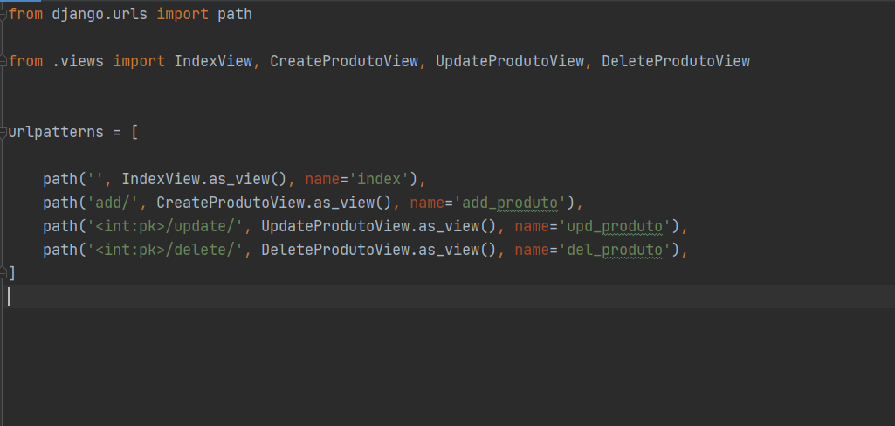
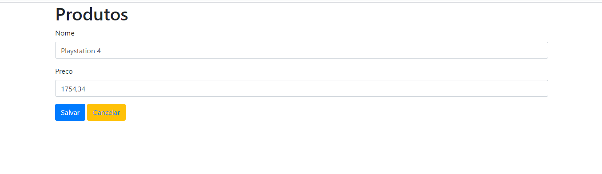

# CRUD Django

> Criando um CRUD Django com Class Based View.
>> O projeto permite que você crie, atualize e delete os dados.

Usando o Class Based Views e retornando na pagina index os produtos cadastrados.

Criando os path na URL do sistema, Permite que você 
DELETE o pruduto e retorne para pagina inicial. 

Da mesma forma para o UPDATE, atualizando o produto e retonando para pagina principal.

